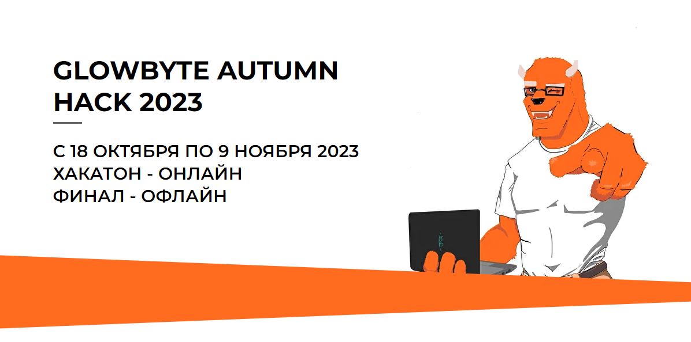

# GlowByte-Autumn-Hack-2023

## Содержание репозитория:
| Номер работы | Название и ссылка | Контент                                                     |
|---------------|-------------------|------------------------------------------------------------------|
|1              |[Скрипт_main.py](https://github.com/AlexeyK12/GlowByte-Autumn-Hack-2023/blob/main/main.py)|Пайплайн обработки и прогнозирования количества затрачиваемой электроэнергии, включающий предобученную модель|
|2              |[Зависимости](https://github.com/AlexeyK12/GlowByte-Autumn-Hack-2023/blob/main/requirements.txt)|Текстовый файл с версиями библиотек|
|3              |[Glowbyte23_part1_команда_8](https://github.com/AlexeyK12/GlowByte-Autumn-Hack-2023/blob/main/glowbyte23_part1_команда_8.ipynb)|Блокнот с ходом решения 1го этапа| 
|4              |[Сертификат](https://github.com/AlexeyK12/GlowByte-Autumn-Hack-2023/blob/main/GlowByteHack_2023.pdf)|GlowByteHack_2023| 

